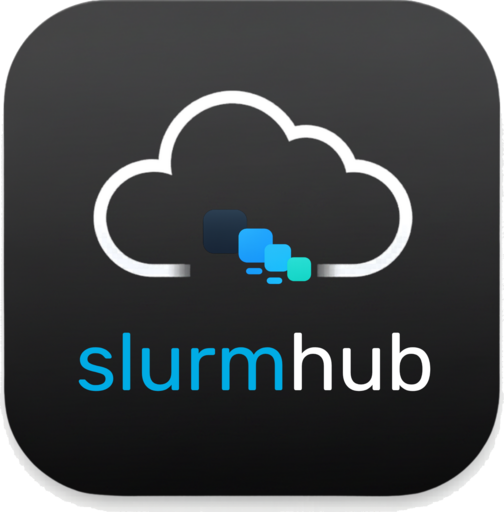
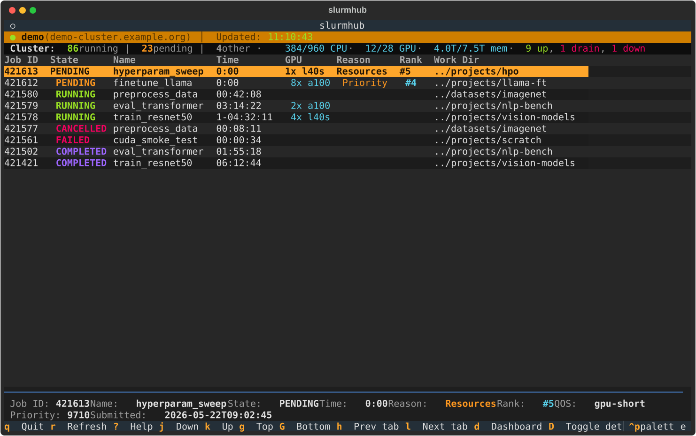

<p align="center">
  
</p>

---

<p align="center">
  <a href="https://pypi.org/project/slurmhub/"></a>
  <a href="https://github.com/matteospanio/slurmhub/actions/workflows/tests.yml"></a>
  <a href="https://matteospanio.github.io/slurmhub/"></a>
  <a href="https://www.python.org/downloads/"></a>
  <a href="LICENSE"></a>
  <a href="https://textual.textualize.io/"></a>
</p>

A keyboard-driven terminal UI for monitoring [Slurm](https://slurm.schedmd.com/) jobs
in real time over SSH. It runs the standard Slurm command-line tools
(`squeue`, `sacct`, `scontrol`, `sinfo`, `sstat`, `nvidia-smi`, `scancel`) against one
or more clusters, parses the output, and presents the result as a rich dashboard
built with [Textual](https://textual.textualize.io/).



## Features

- **Real-time job table** — active jobs from `squeue` merged with recent history from
  `sacct`, color-coded by state.
- **Per-job detail screen** — `scontrol` stats with time / memory / per-GPU
  utilisation bars; one keystroke to the stdout, stderr, or submitted batch script.
- **Cluster dashboard** — cluster-wide CPU / GPU / memory bars, partition summary,
  per-node table fed by `sinfo`.
- **Multi-cluster tabs** — configure several clusters and switch with `h` / `l`;
  filter, search, and sort state is remembered per tab.
- **Persistent job history & analytics** (`H`) — a local SQLite database records every
  run, its resource usage over time, and your favourites; browse, filter, and see
  GPU / CPU / memory-hour aggregates. In the GUI, you can open Job Detail directly
  from History rows, and history capture remains scoped to your jobs even when Queue
  is viewing the full cluster. On by default; `--demo` ships a seeded history.
- **Favourites & notes** — star important runs (`f`) and annotate them (`n`); starred
  runs are exempt from history retention.
- **Vim-style navigation** throughout.
- **OSC 52 yank** — copy job IDs, paths, and log lines to the system clipboard
  through SSH, no `xclip` / `pbcopy` required.
- **First-run wizard** that writes a working TOML config and tests the SSH
  connection.
- **Demo mode** (`--demo`) — exercise the entire TUI against built-in fixture data,
  no cluster needed.

## Installation

`slurmhub` is published on [PyPI](https://pypi.org/project/slurmhub/) and requires
**Python ≥ 3.12** and an OpenSSH client.

The recommended installers are [uv](https://docs.astral.sh/uv/) or
[pipx](https://pipx.pypa.io/) — both install `slurmhub` into its own isolated
environment so its dependencies don't pollute your system Python:

```bash
# uv (https://docs.astral.sh/uv/)
uvx slurmhub                         # one-shot run
uv tool install slurmhub             # persistent install on $PATH
uvx 'slurmhub[tui]' --tui            # one-shot TUI run
uv tool install 'slurmhub[tui]'      # persistent install with TUI deps

# pipx (https://pipx.pypa.io/)
pipx install slurmhub
pipx install 'slurmhub[tui]'         # include terminal UI deps

# plain pip — works, but consider a venv first
pip install --user slurmhub
pip install --user 'slurmhub[tui]'   # include terminal UI deps
```

`slurmhub --tui` requires the optional `tui` dependencies
(`textual` + `rich`).

Then:

```bash
slurmhub --demo    # try it without an SSH connection (desktop GUI)
slurmhub           # run against your configured cluster(s)
slurmhub --tui     # the classic terminal UI (handy over SSH)
```

### Desktop app downloads

From v1.2.0 SlurmHub has a **PySide6 desktop GUI** (the default) as well as the
terminal UI. Standalone binaries that bundle their own Python are attached to each
[GitHub Release](https://github.com/matteospanio/slurmhub/releases/latest) for
Linux, macOS, and Windows — see the [Download page](https://matteospanio.github.io/slurmhub/getting-started/download.html).
The app checks for newer releases on launch and shows a non-blocking banner.

Or clone and run from source (for development):

```bash
git clone https://github.com/matteospanio/slurmhub.git
cd slurmhub
uv sync
uv run slurmhub
# optional TUI deps for --tui and the full test suite:
uv sync --group tui
```

## Quick start

1. Run `slurmhub`. If no config exists at `~/.config/slurmhub/config.toml`,
   the **first-run wizard** walks you through creating one.
2. Set up passwordless SSH to your cluster — `ssh-copy-id` your key and add a
   `Host` alias in `~/.ssh/config`.
3. Reference the alias in your config:

   ```toml
   [profiles.mycluster]
   host = "mycluster"
   ```

Full SSH and configuration walkthrough:
[docs site → Getting started](https://matteospanio.github.io/slurmhub/getting-started/installation.html).

## Documentation

The full documentation lives at
**[matteospanio.github.io/slurmhub](https://matteospanio.github.io/slurmhub/)**.

- [Getting started](https://matteospanio.github.io/slurmhub/getting-started/installation.html) — installation, quickstart, SSH setup
- [Configuration](https://matteospanio.github.io/slurmhub/configuration/overview.html) — TOML schema, profiles, log paths, worked examples
- [Usage guides](https://matteospanio.github.io/slurmhub/usage/job-table.html) — job table, detail screen, log viewer, cluster dashboard, batch script, scancel
- [Reference](https://matteospanio.github.io/slurmhub/reference/keybindings.html) — keybindings, info sources, troubleshooting
- [Changelog](CHANGELOG.md) — release notes

Sphinx sources are under [`docs/`](docs/). Build locally with:

```bash
uv sync --group docs
uv run sphinx-build -b html docs docs/_build/html
```

## Development

```bash
uv sync --group dev --group tui
uv run pytest                       # run the test suite (417 tests)
pre-commit install                  # enable code-quality hooks
uv run python docs/scripts/generate_screenshots.py  # regenerate docs SVGs
```

See [CLAUDE.md](CLAUDE.md) for project context and development notes.

## License

[GPL-3.0](LICENSE) © Matteo Spanio
