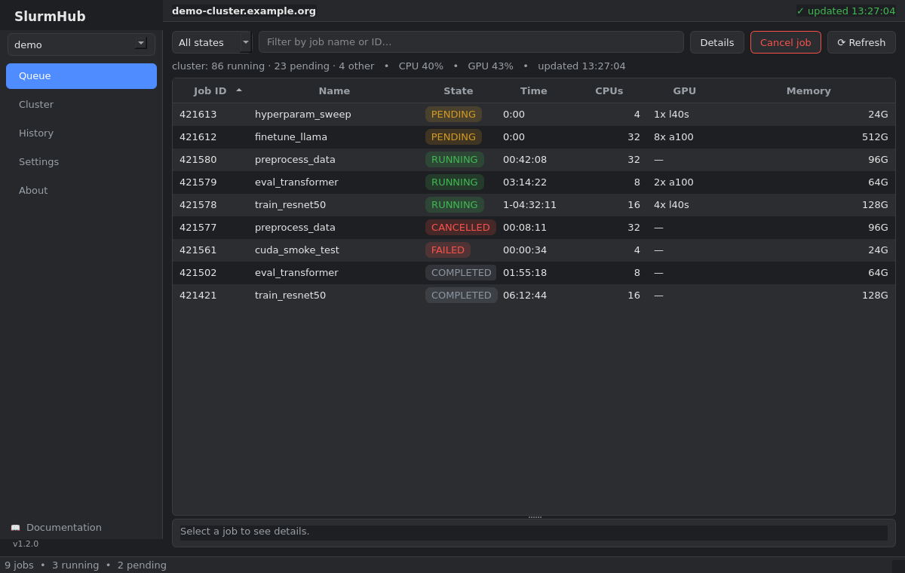

# Download the desktop app

From v1.2.0, SlurmHub ships a **PySide6 desktop GUI** alongside the terminal UI. The
GUI is the default; the TUI is still available with `slurmhub --tui`.



If you have Python ≥ 3.12 you can keep using the [PyPI install](installation.md)
(`uv tool install slurmhub`, `pipx install slurmhub`, …). Add the optional
`tui` extra/group if you want the terminal UI (`slurmhub --tui`). The standalone
binaries below bundle their own Python, so they need **no prior install**.

## Standalone binaries

Grab the latest build for your platform from the
[**Releases page**](https://github.com/matteospanio/slurmhub/releases/latest):

| Platform | Asset |
|----------|-------|
| Linux (x86-64) | `slurmhub-linux.tar.gz` |
| macOS | `slurmhub-macos.tar.gz` |
| Windows | `slurmhub-windows.zip` |

Each asset has a matching `.sha256` checksum. To verify:

```bash
shasum -a 256 -c slurmhub-linux.tar.gz.sha256
```

Then unpack and run the `slurmhub` executable inside:

::::{tab-set}

:::{tab-item} Linux / macOS
```bash
tar -xzf slurmhub-linux.tar.gz
./slurmhub/slurmhub
```
:::

:::{tab-item} Windows
Extract the zip, then run `slurmhub\slurmhub.exe`.
:::

::::

```{admonition} Unsigned builds
:class: note
The binaries are **not yet code-signed**, so the OS may warn on first launch:

- **macOS** — right-click the app → *Open*, then confirm (Gatekeeper).
- **Windows** — *More info* → *Run anyway* (SmartScreen).

If you'd rather avoid the warning, install from PyPI instead.
```

## Staying up to date

On launch the GUI checks the GitHub Releases API and shows a banner when a newer
version is available, linking back to the Releases page. It never downloads or
updates anything automatically — you stay in control of when to upgrade.

PyPI installs update the usual way (`uv tool upgrade slurmhub` / `pipx upgrade
slurmhub`).
